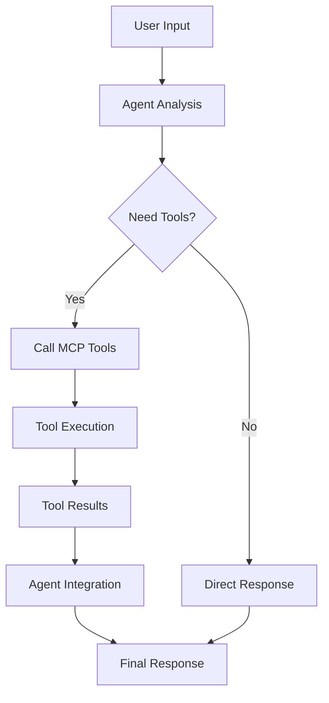

# 🔌 MCP Tool Integration Guide: Unstoppable Agent Capabilities

## 🎯 **What is MCP (Model Context Protocol)?**

**MCP (Model Context Protocol)** is Anthropic's native protocol for integrating external tools and services with Claude models. It allows agents to seamlessly call external APIs, execute functions, and access real-time data during conversations.

### **Key Benefits:**
- ✅ **Native Integration**: Built into Claude's architecture
- ✅ **Real-time Tool Calling**: Agents can call tools during conversation
- ✅ **Secure Communication**: Direct, authenticated tool access
- ✅ **Rich Context**: Tools can provide structured data to agents
- ✅ **Multi-tool Support**: Agents can use multiple tools simultaneously

## 🔍 **Current MCP Implementation in Agent Builder**

### **1. Supported MCP Tools**
```typescript
// Available MCP Tools
const AVAILABLE_MCP_TOOLS = [
  {
    name: 'Firecrawl',
    url: 'https://mcp.firecrawl.dev/{FIRECRAWL_API_KEY}/v2/mcp',
    authType: 'url',
    label: 'Firecrawl',
    description: 'Web scraping and content extraction',
    category: 'web-scraping'
  },
  {
    name: 'Browserbase',
    url: 'https://mcp.browserbase.com/{BROWSERBASE_API_KEY}/v1/mcp',
    authType: 'url',
    label: 'Browserbase',
    description: 'Browser automation and interaction',
    category: 'automation'
  },
  {
    name: 'E2B',
    url: 'https://mcp.e2b.dev/{E2B_API_KEY}/v1/mcp',
    authType: 'url',
    label: 'E2B',
    description: 'Code execution and sandboxed environments',
    category: 'data-processing'
  }
];
```

### **2. How MCP Works in Agent Builder**

#### **Agent Node with MCP Tools:**
```typescript
// Agent node configuration with MCP tools
{
  "type": "agent",
  "data": {
    "nodeType": "agent",
    "label": "Web Research Agent",
    "instructions": "Research the latest AI trends and summarize findings",
    "model": "anthropic/claude-sonnet-4-5-20250929",
    "mcpTools": [
      {
        "name": "Firecrawl",
        "url": "https://mcp.firecrawl.dev/{FIRECRAWL_API_KEY}/v2/mcp",
        "authType": "url",
        "label": "Firecrawl"
      }
    ]
  }
}
```

#### **MCP Node for Direct Tool Execution:**
```typescript
// Direct MCP tool execution
{
  "type": "mcp",
  "data": {
    "nodeType": "mcp",
    "label": "Scrape Website",
    "mcpServers": [{
      "name": "Firecrawl",
      "url": "https://mcp.firecrawl.dev/{FIRECRAWL_API_KEY}/v2/mcp",
      "authType": "url"
    }],
    "mcpAction": "scrape",
    "mcpParams": {
      "url": "{{input.url}}"
    }
  }
}
```

## 🚀 **Enhanced MCP Tool Integration Strategy**

### **1. Automatic Tool Detection**
The system can automatically detect which MCP tools are needed based on user prompts:

```typescript
// Smart tool detection
export function analyzePromptForMCPTools(prompt: string): MCPToolConfig[] {
  const lowerPrompt = prompt.toLowerCase();
  const requiredTools: MCPToolConfig[] = [];

  // Web scraping indicators
  if (webScrapingKeywords.some(keyword => lowerPrompt.includes(keyword))) {
    requiredTools.push(FIRECRAWL_TOOL);
  }

  // Browser automation indicators
  if (automationKeywords.some(keyword => lowerPrompt.includes(keyword))) {
    requiredTools.push(BROWSERBASE_TOOL);
  }

  // Code execution indicators
  if (codeExecutionKeywords.some(keyword => lowerPrompt.includes(keyword))) {
    requiredTools.push(E2B_TOOL);
  }

  return requiredTools;
}
```

### **2. Multi-Tool Agent Workflows**
Agents can use multiple MCP tools in sequence or parallel:

```typescript
// Multi-tool agent configuration
{
  "mcpTools": [
    {
      "name": "Firecrawl",
      "url": "https://mcp.firecrawl.dev/{FIRECRAWL_API_KEY}/v2/mcp",
      "authType": "url",
      "label": "Firecrawl"
    },
    {
      "name": "E2B",
      "url": "https://mcp.e2b.dev/{E2B_API_KEY}/v1/mcp",
      "authType": "url",
      "label": "E2B"
    }
  ]
}
```

### **3. Tool Calling Flow**


## 🛠️ **Advanced MCP Tool Categories**

### **1. Web Scraping & Data Extraction**
- **Firecrawl**: Web scraping, content extraction, search
- **Custom Scrapers**: Site-specific data extraction
- **API Integrations**: REST API data fetching

### **2. Browser Automation**
- **Browserbase**: Browser automation, form filling, interaction
- **Selenium**: Web testing and automation
- **Playwright**: Cross-browser automation

### **3. Code Execution & Processing**
- **E2B**: Sandboxed code execution
- **Jupyter**: Interactive code notebooks
- **Custom Functions**: User-defined processing logic

### **4. AI & ML Tools**
- **Hugging Face**: Model inference and training
- **OpenAI**: GPT models and embeddings
- **Custom ML**: Specialized AI models

### **5. Database & Storage**
- **PostgreSQL**: Database queries and operations
- **MongoDB**: Document database operations
- **S3**: File storage and retrieval

## 🔧 **Implementation Examples**

### **1. Web Research Agent**
```typescript
// Agent that can search, scrape, and analyze web content
{
  "type": "agent",
  "data": {
    "instructions": "Research the latest AI trends by searching the web, scraping relevant articles, and analyzing the content",
    "mcpTools": [
      {
        "name": "Firecrawl",
        "url": "https://mcp.firecrawl.dev/{FIRECRAWL_API_KEY}/v2/mcp",
        "authType": "url"
      }
    ]
  }
}
```

### **2. Data Processing Agent**
```typescript
// Agent that can execute code and process data
{
  "type": "agent",
  "data": {
    "instructions": "Analyze the provided dataset and generate insights using Python",
    "mcpTools": [
      {
        "name": "E2B",
        "url": "https://mcp.e2b.dev/{E2B_API_KEY}/v1/mcp",
        "authType": "url"
      }
    ]
  }
}
```

### **3. Browser Automation Agent**
```typescript
// Agent that can interact with web browsers
{
  "type": "agent",
  "data": {
    "instructions": "Navigate to the website, fill out the form, and submit it",
    "mcpTools": [
      {
        "name": "Browserbase",
        "url": "https://mcp.browserbase.com/{BROWSERBASE_API_KEY}/v1/mcp",
        "authType": "url"
      }
    ]
  }
}
```

## 🎯 **Tool Calling Patterns**

### **1. Sequential Tool Calling**
```typescript
// Agent uses tools in sequence
User: "Research AI trends and create a report"
Agent: 
  1. Call Firecrawl to search for AI articles
  2. Call Firecrawl to scrape top articles
  3. Call E2B to analyze and summarize content
  4. Generate final report
```

### **2. Parallel Tool Calling**
```typescript
// Agent uses multiple tools simultaneously
User: "Compare AI tools from different sources"
Agent:
  1. Call Firecrawl to search Google
  2. Call Firecrawl to search Bing
  3. Call E2B to analyze both results
  4. Generate comparison report
```

### **3. Conditional Tool Calling**
```typescript
// Agent decides which tools to use based on context
User: "Help me with data analysis"
Agent:
  - If data is web-based → Use Firecrawl
  - If data needs processing → Use E2B
  - If data needs visualization → Use custom tools
```

## 🔒 **Security & Best Practices**

### **1. API Key Management**
```typescript
// Secure API key handling
const apiKeys = {
  firecrawl: process.env.FIRECRAWL_API_KEY,
  browserbase: process.env.BROWSERBASE_API_KEY,
  e2b: process.env.E2B_API_KEY
};
```

### **2. Tool Validation**
```typescript
// Validate tool calls before execution
function validateToolCall(toolCall: any): boolean {
  // Check if tool is allowed
  // Validate parameters
  // Check rate limits
  // Verify authentication
}
```

### **3. Error Handling**
```typescript
// Robust error handling for tool calls
try {
  const result = await executeToolCall(toolCall);
  return result;
} catch (error) {
  // Log error
  // Return fallback response
  // Notify user of issue
}
```

## 🚀 **Future Enhancements**

### **1. Custom MCP Servers**
- User-defined MCP servers
- Custom tool integrations
- Specialized domain tools

### **2. Tool Marketplace**
- Pre-built tool integrations
- Community-contributed tools
- Tool discovery and sharing

### **3. Advanced Tool Orchestration**
- Tool dependency management
- Parallel tool execution
- Tool result aggregation

### **4. Tool Learning**
- AI learns which tools to use
- Automatic tool selection
- Performance optimization

## 🎉 **The Unstoppable Agent Builder**

With MCP tool integration, your agents become **unstoppable**:

- ✅ **Web Research**: Search, scrape, and analyze any website
- ✅ **Data Processing**: Execute code, run algorithms, process data
- ✅ **Browser Automation**: Interact with any web application
- ✅ **API Integration**: Connect to any external service
- ✅ **Real-time Data**: Access live information and updates
- ✅ **Multi-tool Workflows**: Combine multiple tools for complex tasks

**Your agents can now:**
- Research any topic on the web
- Process and analyze data with code
- Automate browser interactions
- Integrate with external APIs
- Execute complex multi-step workflows
- Provide real-time, accurate information

The **Model Context Protocol** transforms your agents from simple text generators into **powerful, tool-wielding AI assistants** that can interact with the real world! 🤖✨🚀
