# Agent Builder Application Architecture

## Overview
This document contains a comprehensive Mermaid diagram representing the architecture and data flow of the Agent Builder application.

## Architecture Diagram

```mermaid
%%{init: {'flowchart': {'htmlLabels': true, 'curve': 'basis'}}}%%
flowchart TD
    %% User Interface Layer
    subgraph "Frontend Layer"
        UI["🖥️ Next.js Frontend<br/>React + Tailwind CSS"]
        WB["🔧 Visual Workflow Builder<br/>Drag & Drop Interface"]
        RT["📊 Real-time Execution Display<br/>SSE Streaming"]
        SET["⚙️ Settings Panel<br/>API Keys & MCP Config"]
        
        UI --> WB
        UI --> RT
        UI --> SET
    end

    %% Authentication & Authorization
    subgraph "Authentication"
        CLERK["🔐 Clerk Authentication<br/>User Management"]
        AUTH["🛡️ API Key Validation<br/>Bearer Token Auth"]
        
        CLERK --> AUTH
    end

    %% API Layer
    subgraph "API Layer"
        API["🌐 Next.js API Routes<br/>RESTful Endpoints"]
        SSE["📡 Server-Sent Events<br/>Real-time Streaming"]
        MID["🔒 Middleware<br/>Route Protection"]
        
        API --> SSE
        API --> MID
    end

    %% Core Execution Engine
    subgraph "Execution Engine"
        LG["🧠 LangGraph Executor<br/>State Management"]
        NODES["🔗 Node Executors<br/>Agent, MCP, Transform"]
        STATE["📋 Workflow State<br/>Variables & Context"]
        
        LG --> NODES
        LG --> STATE
    end

    %% Database Layer
    subgraph "Database Layer"
        DB["🗄️ PostgreSQL (Neon)<br/>Primary Database"]
        PRISMA["🔧 Prisma ORM<br/>Database Client"]
        SCHEMA["📊 Database Schema<br/>Users, Workflows, Executions"]
        
        DB --> PRISMA
        PRISMA --> SCHEMA
    end

    %% LLM Providers
    subgraph "LLM Providers"
        ANTHROPIC["🤖 Anthropic Claude<br/>Sonnet 4.5 & Haiku 4.5"]
        OPENAI["🧠 OpenAI GPT<br/>GPT-4o & GPT-4o-mini"]
        GROQ["⚡ Groq<br/>Fast Inference"]
        
        ANTHROPIC -.->|"Native MCP Support"| MCP
        OPENAI -.->|"Function Calling"| MCP
        GROQ -.->|"OpenAI Compatible"| MCP
    end

    %% MCP (Model Context Protocol)
    subgraph "MCP Ecosystem"
        MCP["🔌 MCP Protocol<br/>Tool Integration"]
        FIRECRAWL["🕷️ Firecrawl<br/>Web Scraping & Search"]
        BROWSER["🌐 Browserbase<br/>Browser Automation"]
        E2B["💻 E2B<br/>Code Execution"]
        CUSTOM["🛠️ Custom MCP Servers<br/>User-defined Tools"]
        
        MCP --> FIRECRAWL
        MCP --> BROWSER
        MCP --> E2B
        MCP --> CUSTOM
    end

    %% Workflow Node Types
    subgraph "Workflow Nodes"
        START["▶️ Start Node<br/>Workflow Entry Point"]
        AGENT["🤖 Agent Node<br/>LLM + MCP Tools"]
        MCP_NODE["🔌 MCP Node<br/>Direct Tool Execution"]
        TRANSFORM["🔄 Transform Node<br/>Data Processing"]
        IF_ELSE["❓ If/Else Node<br/>Conditional Logic"]
        WHILE["🔄 While Loop<br/>Iteration Control"]
        APPROVAL["✅ User Approval<br/>Human-in-the-loop"]
        EXTRACT["📤 Extract Node<br/>Structured Data"]
        HTTP["🌐 HTTP Node<br/>API Calls"]
        END["🏁 End Node<br/>Workflow Completion"]
        
        START --> AGENT
        AGENT --> MCP_NODE
        AGENT --> TRANSFORM
        TRANSFORM --> IF_ELSE
        IF_ELSE --> WHILE
        WHILE --> APPROVAL
        APPROVAL --> EXTRACT
        EXTRACT --> HTTP
        HTTP --> END
    end

    %% Rate Limiting & Optimization
    subgraph "Performance & Rate Limiting"
        RL["⏱️ Rate Limiting<br/>Token Bucket Algorithm"]
        TO["🔧 Token Optimization<br/>Content Truncation"]
        CB["🚨 Circuit Breaker<br/>Ultra-aggressive Limits"]
        MON["📊 Rate Limit Monitoring<br/>Real-time Dashboard"]
        
        RL --> TO
        TO --> CB
        CB --> MON
    end

    %% Data Flow Connections
    UI --> CLERK
    CLERK --> API
    API --> LG
    LG --> NODES
    NODES --> ANTHROPIC
    NODES --> OPENAI
    NODES --> GROQ
    NODES --> MCP
    MCP --> FIRECRAWL
    LG --> DB
    DB --> PRISMA
    API --> RL
    RL --> TO
    TO --> CB

    %% Styling
    classDef frontend fill:#e1f5fe,stroke:#01579b,stroke-width:2px
    classDef auth fill:#f3e5f5,stroke:#4a148c,stroke-width:2px
    classDef api fill:#e8f5e8,stroke:#1b5e20,stroke-width:2px
    classDef engine fill:#fff3e0,stroke:#e65100,stroke-width:2px
    classDef database fill:#fce4ec,stroke:#880e4f,stroke-width:2px
    classDef llm fill:#e0f2f1,stroke:#004d40,stroke-width:2px
    classDef mcp fill:#fff8e1,stroke:#f57f17,stroke-width:2px
    classDef nodes fill:#f1f8e9,stroke:#33691e,stroke-width:2px
    classDef perf fill:#ffebee,stroke:#c62828,stroke-width:2px

    class UI,WB,RT,SET frontend
    class CLERK,AUTH auth
    class API,SSE,MID api
    class LG,NODES,STATE engine
    class DB,PRISMA,SCHEMA database
    class ANTHROPIC,OPENAI,GROQ llm
    class MCP,FIRECRAWL,BROWSER,E2B,CUSTOM mcp
    class START,AGENT,MCP_NODE,TRANSFORM,IF_ELSE,WHILE,APPROVAL,EXTRACT,HTTP,END nodes
    class RL,TO,CB,MON perf
```

## Key Features Represented

### 🏗️ **Architecture Components**
- **Frontend**: Next.js with React and Tailwind CSS
- **Authentication**: Clerk for user management
- **API Layer**: RESTful endpoints with SSE streaming
- **Execution Engine**: LangGraph for workflow orchestration
- **Database**: PostgreSQL with Prisma ORM
- **LLM Providers**: Anthropic, OpenAI, and Groq
- **MCP Ecosystem**: Model Context Protocol for tool integration

### 🔄 **Workflow Node Types**
- **Core Nodes**: Start, Agent, End
- **Tool Nodes**: MCP integration
- **Logic Nodes**: If/Else, While loops, User approval
- **Data Nodes**: Transform, Extract, HTTP requests

### ⚡ **Performance Features**
- **Rate Limiting**: Token bucket algorithm
- **Token Optimization**: Content truncation for large data
- **Circuit Breaker**: Ultra-aggressive limits for massive content
- **Monitoring**: Real-time rate limit dashboard

### 🔌 **MCP Integration**
- **Firecrawl**: Web scraping and search
- **Browserbase**: Browser automation
- **E2B**: Code execution in sandboxes
- **Custom Servers**: User-defined MCP tools

## Data Flow

1. **User Interface** → Visual workflow builder
2. **Authentication** → Clerk validates user
3. **API Routes** → Handle workflow execution requests
4. **LangGraph Executor** → Orchestrates node execution
5. **Node Executors** → Execute specific node logic
6. **LLM Providers** → Process AI requests
7. **MCP Tools** → Integrate external services
8. **Database** → Store workflows and execution data
9. **Rate Limiting** → Optimize token usage and prevent limits

This architecture enables building complex AI agent workflows with visual interfaces, real-time execution, and extensive tool integration capabilities.
